# 🚀 Sistema di Gestione Ticket

Benvenuto nel **Sistema di Gestione Ticket**, un'applicazione web sviluppata con **Spring Boot** per facilitare la gestione efficiente dei ticket di supporto all'interno di un'organizzazione. Questo sistema offre una serie di funzionalità  per amministratori e operatori, garantendo sicurezza e facilità d'uso. Tuttavia, l'applicazione è ancora a un livello embrionale, e ci sono molti dettagli e funzionalità che desidero implementare per renderla più completa e raffinata.

## 🛠️ **Funzionalità Principali**

### 🎫 **Gestione dei Ticket**
- **Creazione, Visualizzazione, Modifica ed Eliminazione:** Gestisci i ticket in modo semplice e intuitivo.
- **Assegnazione agli Operatori:** Assegna i ticket agli operatori disponibili per una gestione ottimale.
- **Aggiornamento dello Stato dei Ticket:** Monitora lo stato dei ticket con categorie come **Da Fare**, **In Corso**, **Completato** e **Annullato**.
- **Aggiunta di Note:** Inserisci note per comunicazioni interne e aggiornamenti sullo stato dei ticket.

### 👥 **Gestione degli Operatori**
- **Aggiunta e Rimozione:** Gli amministratori possono aggiungere o rimuovere operatori facilmente.
- **Attivazione e Disattivazione:** Gestisci lo stato degli operatori con verifiche sui ticket pendenti.
- **Visualizzazione Stato Operatori:** Controlla se gli operatori sono **Attivi** o **Inattivi**.

### 📂 **Gestione delle Categorie**
- **Creazione, Modifica ed Eliminazione:** Organizza i ticket tramite categorie per una migliore classificazione.
- **Assegnazione di Categorie ai Ticket:** Migliora la gestione e il tracciamento dei ticket assegnando categorie specifiche.

### 🔒 **Sicurezza e Autenticazione**
- **Autenticazione Basata su Ruoli:** Differenzia tra **amministratori** e **operatori** per controllare l'accesso alle funzionalità.
- **Protezione delle Rotte Sensibili:** Utilizza **Spring Security** per proteggere le aree critiche dell'applicazione.
- **Codifica delle Password:** Garantisce la sicurezza degli utenti mediante la codifica delle password.

### 📊 **Dashboard Personalizzate**
- **Interfaccia Amministratori:** Accesso completo a tutte le funzionalità per una gestione centralizzata.
- **Interfaccia Operatori:** Focus sui ticket assegnati, facilitando la gestione quotidiana.

## 🖥️ **Tecnologie Utilizzate**

### 🔧 **Backend**
- **Java 11+**
- **Spring Boot**
- **Spring MVC**
- **Spring Data JPA**
- **Spring Security**

### 🎨 **Frontend**
- **Thymeleaf**
- **Bootstrap 5**

### 🗄️ **Database**
- **MySQL** 

### 🛠️ **Strumenti di Gestione Database**
- **DBeaver:** Utilizzato per la gestione e l'amministrazione del database.

## 🔐 **Credenziali di Accesso Predefinite**

### **Amministratore**
- **Email:** `admin@esempio.com`
- **Password:** `password`

### **Operatore**
- **Email:** `operatore@esempio.com`
- **Password:** `password`

## 📜 **Licenza**

Questo progetto è distribuito sotto la **Licenza MIT**. Vedi il file [LICENSE](LICENSE) per ulteriori dettagli.

## 📸 **Screenshot**

## 👨‍💼 Admin

### 📊 Dashboard Amministratore
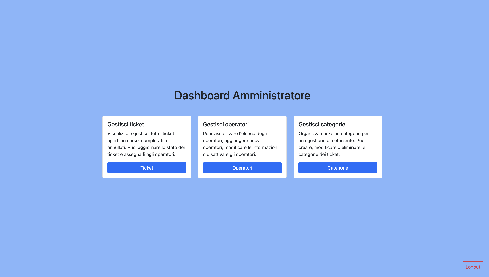

### 🎫 Gestione dei Ticket (Admin)
- **Lista Tutti i Ticket**
  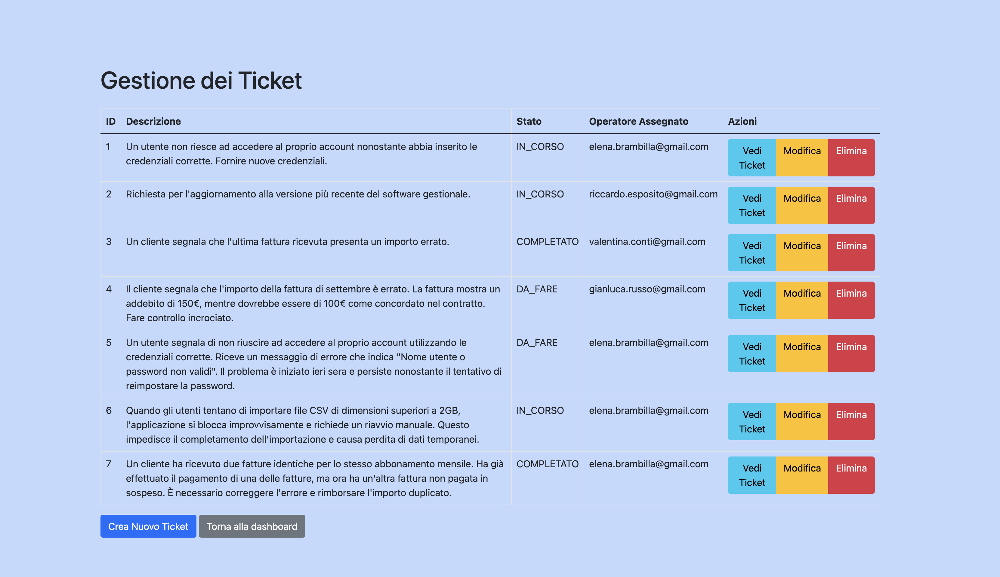
- **Dettaglio Singolo Ticket**
  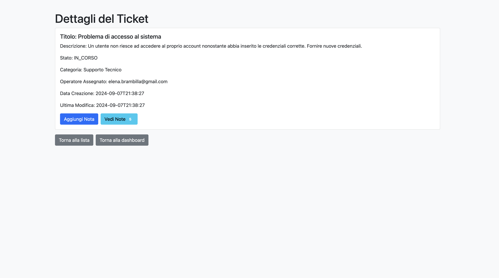
- **Form Crea Nuovo Ticket**
  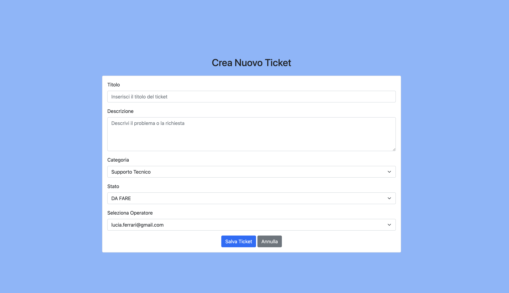
- **Modifica Ticket**
  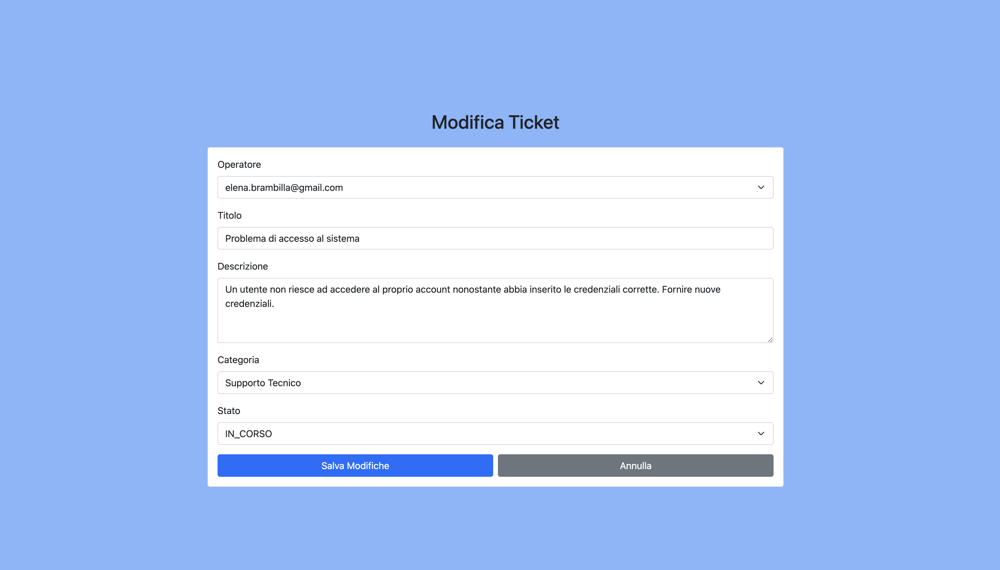

### 👥 Gestione degli Operatori (Admin)
- **Lista Operatori**
  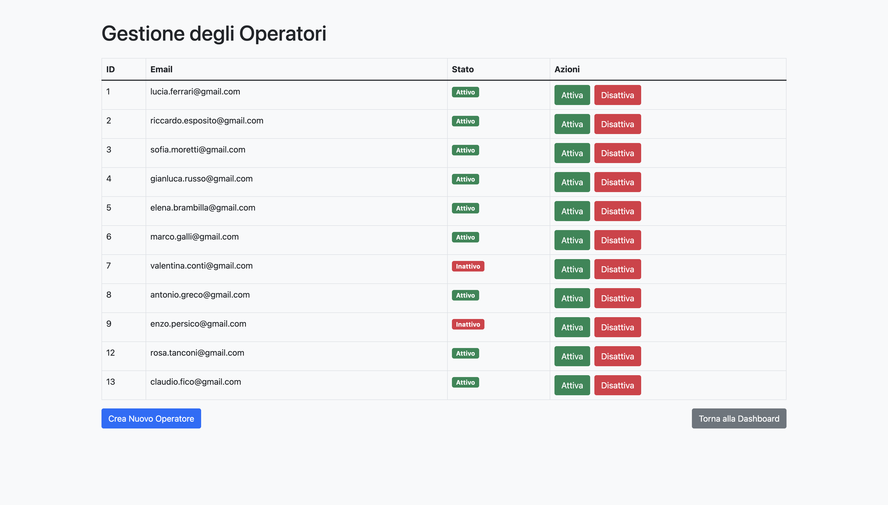
- **Form Crea Nuovo Operatore**
  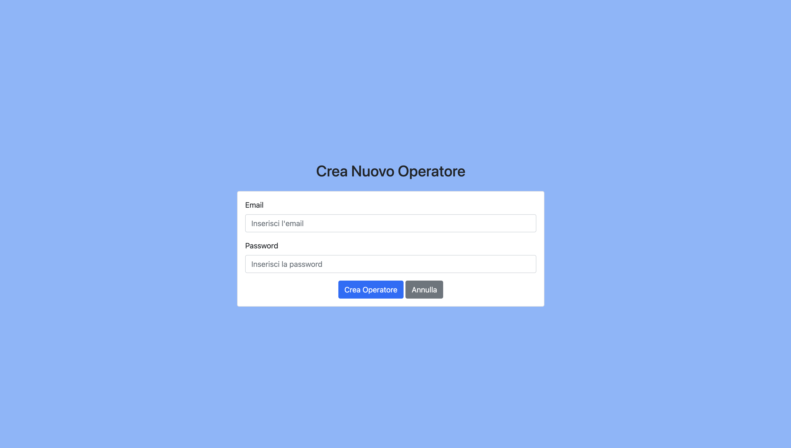

### 📂 Gestione delle Categorie (Admin)
- **Lista Categorie**
  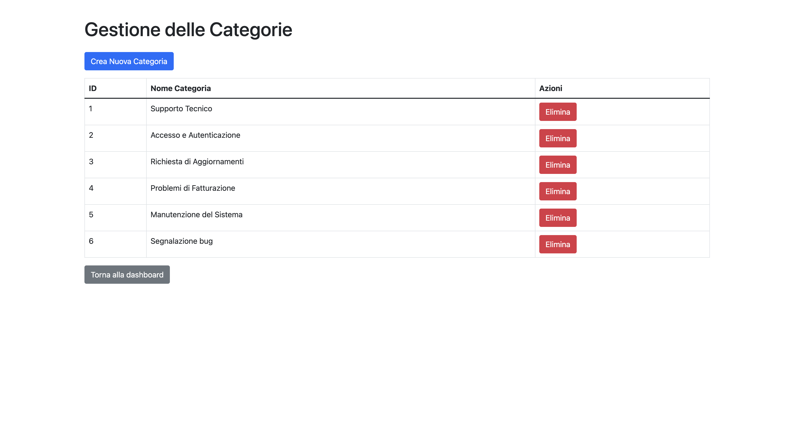
- **Crea Nuova Categoria**
  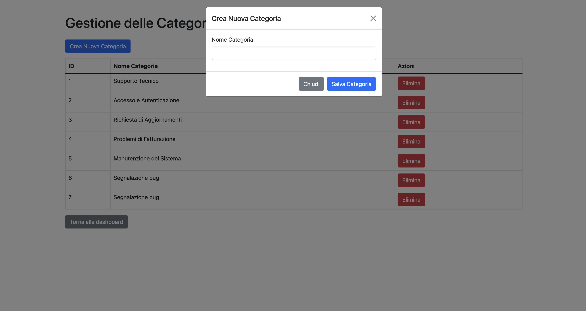

---

## 👨‍🔧 Operatore

### 📊 Dashboard Operatore
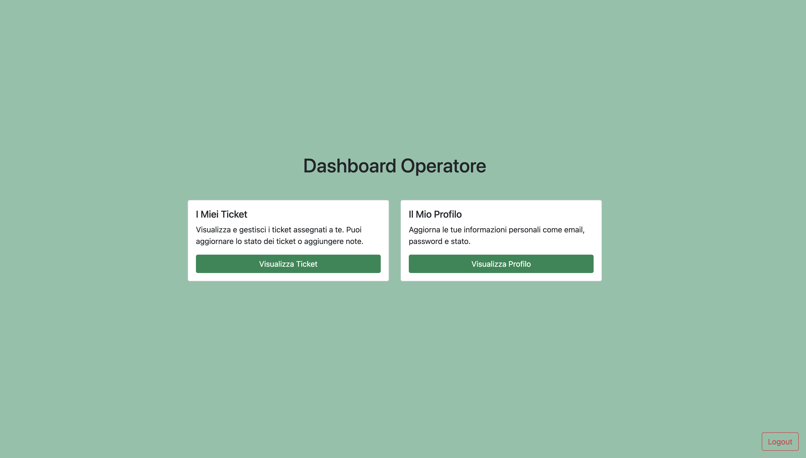

### 🎫 Gestione dei Ticket (Operatore)
- **Dettaglio Singolo Ticket**
  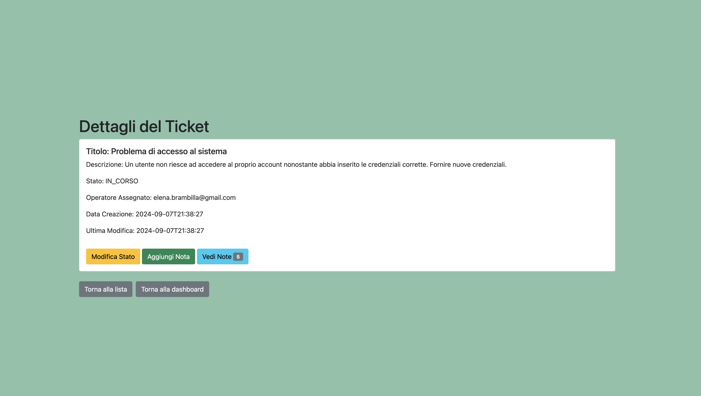
- **Modifica Stato Ticket**
  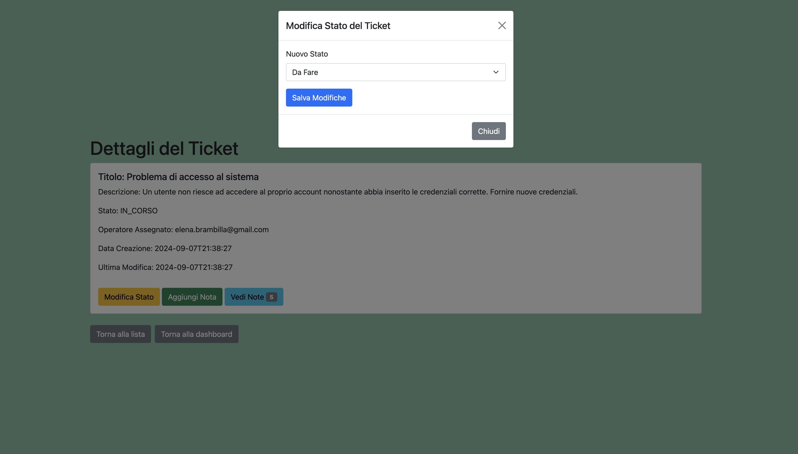

### 👥 Profilo Operatore
- **Modifica Profilo Operatore**
  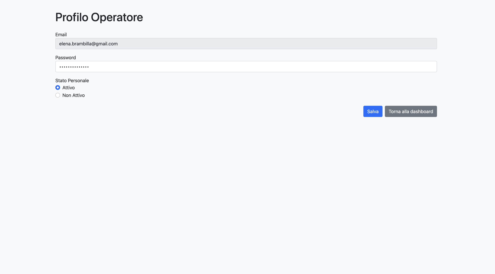
- **Visualizzazione Profilo Operatore**
  

---

## 📝 Gestione delle Note (Admin e Operatore)

- **Lista Note Singolo Ticket**
  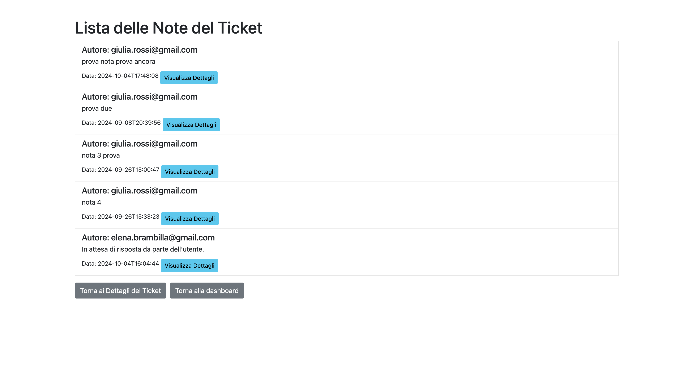

### Admin:
- **Form Aggiungi Nota (Admin)**
  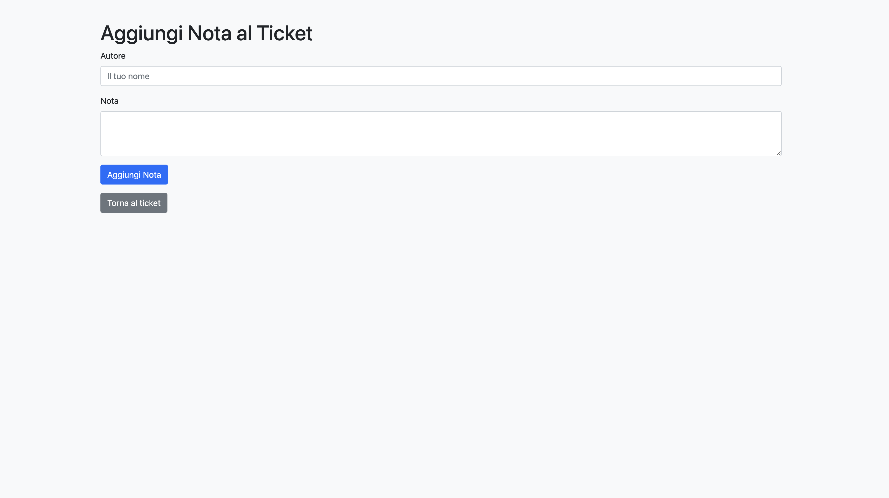
- **Modifica Nota (Admin)**
  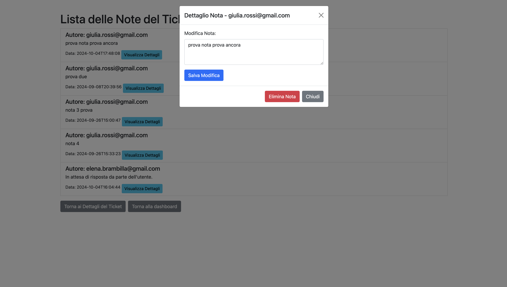

### Operatore:
- **Form Aggiunta Nota (Operatore)**
  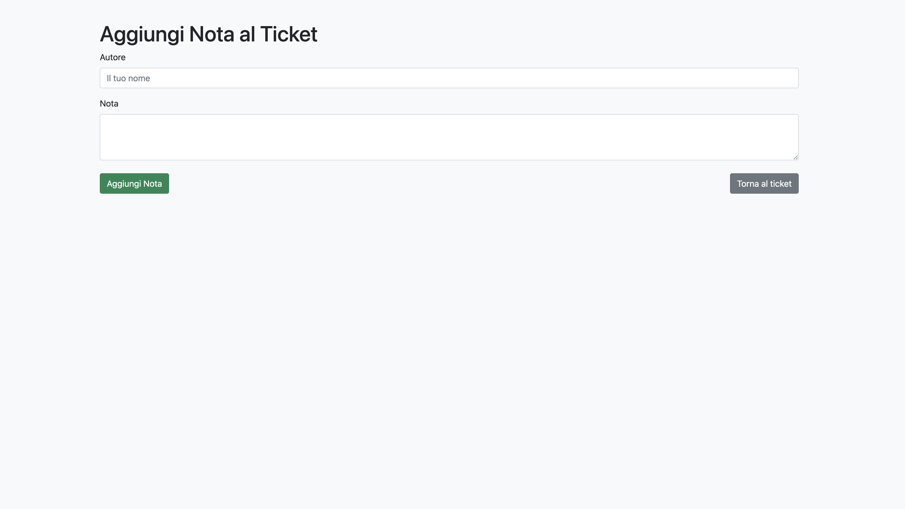
- **Modifica Nota (Operatore)**
  

---

## 🔐 Pagina di Login
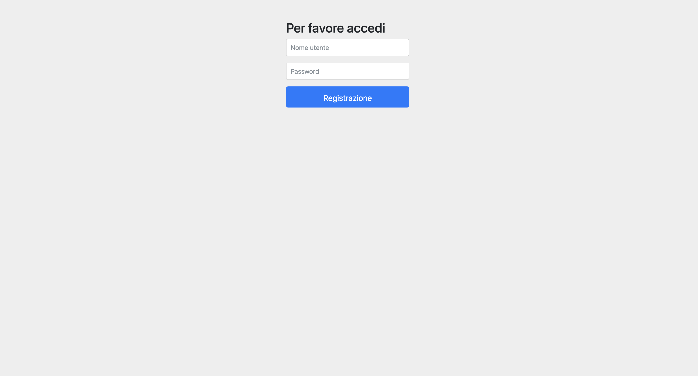
